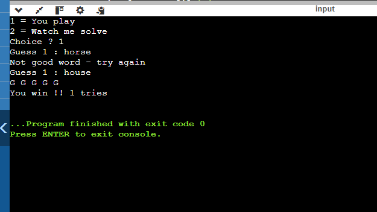
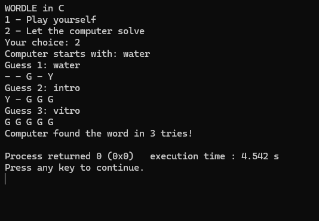

# Wordle ALGO3 Project

**Group:** Belhadj Abdelhakim - Mekdam Mohamed Idir - Lamara Ayoub

Simple Wordle game and automated solver in C.

## How to run 

1. Put main.c and words.txt in the same folder
2. Open the project in Code::Blocks (or any C compiler)
3. Click Build & Run 

Choose 1 to play, 2 to watch solver.

## Screenshots

### Human Play

### Automated Solver

See report.pdf for all details
